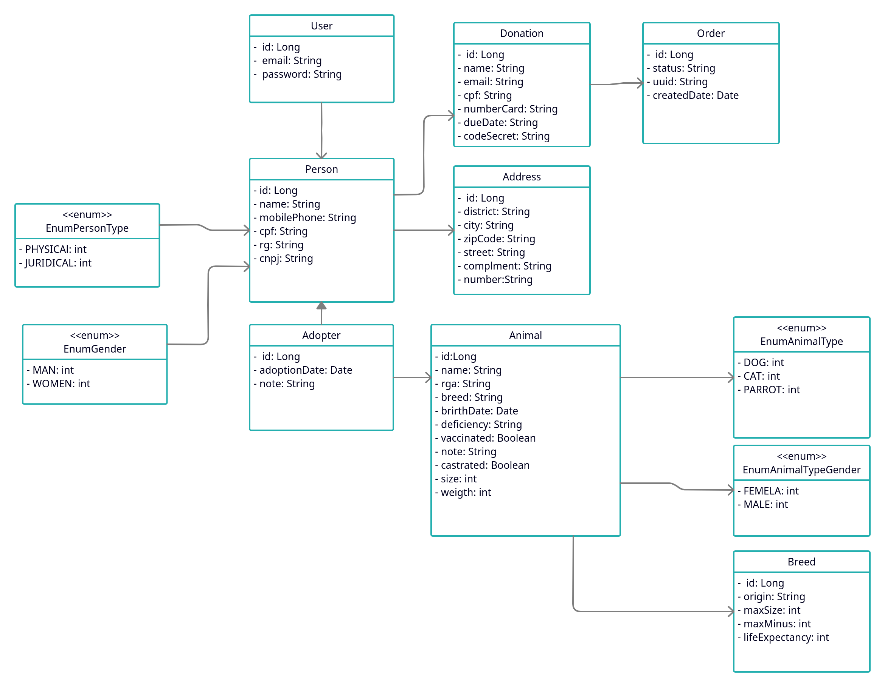
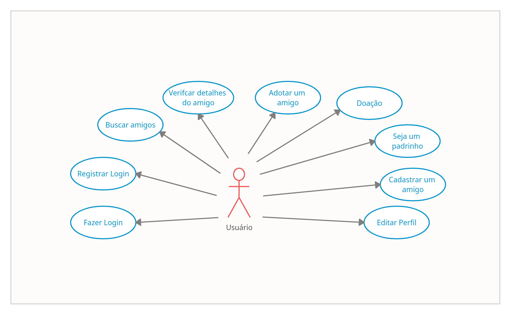
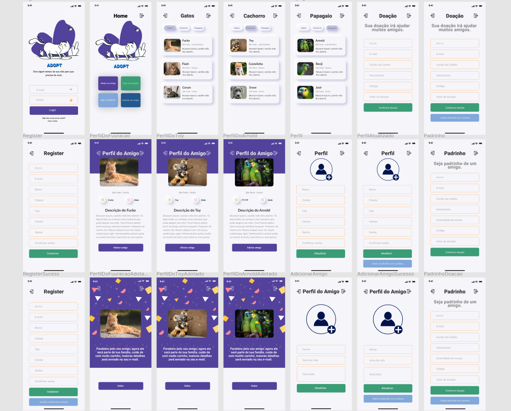

# Adopt - Adoção é um ato de amor!

## Descrição do projeto
<p >Projeto nascido com objetivo simples facilitar doação de animais e doação financeira para abrigar mais animais. </p>

# Diagrama de classes 



# Caso de Uso



# Descrição de caso de uso

## Fazer Login 

<p><strong>Descrição:</strong> Esse caso de uso descreve como efetuar o login</p>
<p><strong>Ator:</strong> Usuário</p>
<p><strong>Prioridade:</strong> Alta</p>
<p><strong>Pré-Condição:</strong> O usuário cadastrado no sistema</p>
<p><strong>Fluxo de evento principal:</strong></p>

<ul>
	<li>Usuário digita e-mail</li>
	<li>Usuário digita senha</li>
	<li>Clica no botão Login</li>
	<li>Usuário com as credenciais correta, será direcionado para home do app</li>
	
</ul>

<p><strong>Fluxo de evento secundário:</strong></p>

<ul>
	<li>Usuário com os dados incorreto será exibida um mensagem de "Verifique os dados incorretos." </li>
</ul>

## Registrar Login

<p><strong>Descrição:</strong> Esse caso de uso descreve como registrar o login</p>
<p><strong>Ator:</strong> Usuário</p>
<p><strong>Prioridade:</strong> Alta</p>
<p><strong>Pré-Condição:</strong> O usuário cadastrado no sistema</p>
<p><strong>Fluxo de evento principal:</strong></p>

<ul>
	<li>Usuário digita nome</li>
	<li>Usuário digita email</li>
	<li>Usuário digita cep</li>
	<ul>
		<li>Buscar o cep na api de cep</li>
		<li>Trazer as informações de do cep</li>
		<li>Preencher campo bairro</li>
		<li>Preencher campo cidade</li>
	</ul>
	<li>Usuário digita número</li>
	<li>Usuário digita complemento</li>
	<li>Usuário digita senha</li>
	<li>Usuário digita confirmar senha</li>
	<li>Clica no botão cadastrar</li>
	<li>Usuário cadastrado com sucesso</li>
</ul>

<p><strong>Fluxo de evento secundário:</strong></p>

<ul>
	<li>Usuário com os dados incorreto será exibida um mensagem de verifique os campos incorretos. </li>
</ul>


## Buscar Amigos

<p><strong>Descrição:</strong> Esse caso de uso descreve como buscar amigos</p>
<p><strong>Ator:</strong> Usuário</p>
<p><strong>Prioridade:</strong> Alta</p>
<p><strong>Pré-Condição:</strong> O usuário cadastrado no sistema</p>
<p><strong>Fluxo de evento principal:</strong></p>

<ul>
	<li>Selecionar tipo de amigo</li>
	<li>Trazer o resultado dos amigos</li>
</ul>

<p><strong>Fluxo de evento secundário:</strong></p>

<ul>
	<li>Não existir amigo cadastrado. </li>
</ul>

## Verificar detalhes do amigo

<p><strong>Descrição:</strong> Esse caso de uso descreve como verificar os detalhes do amigo</p>
<p><strong>Ator:</strong> Usuário</p>
<p><strong>Prioridade:</strong> Alta</p>
<p><strong>Pré-Condição:</strong> O usuário cadastrado no sistema</p>
<p><strong>Fluxo de evento principal:</strong></p>

<ul>
	<li>Clica no amigo</li>
	<li>Direcionado para tela perfil do amigo</li>
	<li>Exibir: Cidade - Bairro</li>
	<li>Exibir: Descrição do amigo</li>
</ul>

## Adotar um amigo

<p><strong>Descrição:</strong> Esse caso de uso descreve como adotar um amigo</p>
<p><strong>Ator:</strong> Usuário</p>
<p><strong>Prioridade:</strong> Alta</p>
<p><strong>Pré-Condição:</strong> O usuário cadastrado no sistema</p>
<p><strong>Fluxo de evento principal:</strong></p>

<ul>
	<li>Clicar no botão Adotar amigo</li>
	<li>Exibir uma mensagem  "Parabéns pelo seu amigo, agora será parte da sua familia, cuide de com muito carinho, maiores detalhes 
	será enviado no seu e-mail </li>
	<li> enviar e-mail com detalhes sobre o amigo e detalhes</li>
</ul>

## Doação

<p><strong>Descrição:</strong> Esse caso de uso descreve doação</p>
<p><strong>Ator:</strong> Usuário</p>
<p><strong>Prioridade:</strong> Alta</p>
<p><strong>Pré-Condição:</strong> O usuário cadastrado no sistema</p>
<p><strong>Fluxo de evento principal:</strong></p>

<ul>	
	<li>Usuário digita nome</li>
	<li>Usuário digita email</li>
	<li>Usuário digita cartão de credito</li>
	<li>Usuário digita vencimento</li>
	<li>Usuário digita valor da doação</li>
	<li>Clica no botão Confirmar doação</li>
	<li>Mensagem : Doação efetuada com sucesso </li>
</ul>

<p><strong>Fluxo de evento secundário:</strong></p>

<ul>
	<li>Cartão de credito com dados errados, retornando o erro. </li>
	<li>Mensagem: Verifique os dados informado </li>
	<li>Operadora não autorizou ordem de pagamento </li>
</ul>


## Seja um padrinho

<p><strong>Descrição:</strong> Esse caso de uso descreve como ser um padrinho</p>
<p><strong>Ator:</strong> Usuário</p>
<p><strong>Prioridade:</strong> Alta</p>
<p><strong>Pré-Condição:</strong> O usuário cadastrado no sistema</p>
<p><strong>Fluxo de evento principal:</strong></p>

<ul>	
	<li>Usuário digita nome</li>
	<li>Usuário digita email</li>
	<li>Usuário digita cartão de credito</li>
	<li>Usuário digita vencimento</li>
	<li>Quantidade de meses</li>
	<li>Usuário digita valor da doação</li>
	<li>Clica no botão Confirmar doação</li>
	<li>Mensagem: Doação efetuada com sucesso </li>
</ul>

<p><strong>Fluxo de evento secundário:</strong></p>

<ul>
	<li>Cartão de credito com dados errados, retornando o erro. </li>
	<li>Mensagem: Verifique os dados informado </li>
	<li>Operadora não autorizou ordem de pagamento </li>
</ul>


## Cadastrar um amigo

<p><strong>Descrição:</strong> Esse caso de uso descreve como cadastrar um amigo </p>
<p><strong>Ator:</strong> Usuário</p>
<p><strong>Prioridade:</strong> Alta</p>
<p><strong>Pré-Condição:</strong> O usuário cadastrado no sistema</p>
<p><strong>Fluxo de evento principal:</strong></p>

<ul>
	<li>Usuário digita nome</li>
	<li>Usuário digita anos de vida</li>
	<li>Usuário digita descrição do amigo</li>
	<li>Usuário digita raça do amigo</li>
	<li>Usuário selecione o sexo do animal</li>
	<li>Usuário selecione vacinado</li>
	<li>Usuário selecione uma imagem do amigo</li>
	<li>Cadastrar um amigo</li>
	<li>Mensagem: Amigo cadastrado com sucesso</li>
</ul>

<p><strong>Fluxo de evento secundário:</strong></p>

<ul>
	<li>Dados incorreto. </li>
	<li>Mensagem: Verifique os dados informado </li>
</ul>


## Editar Perfil

<p><strong>Descrição:</strong> Esse caso de uso descreve como editar o perfil</p>
<p><strong>Ator:</strong> Usuário</p>
<p><strong>Prioridade:</strong> Alta</p>
<p><strong>Pré-Condição:</strong> O usuário cadastrado no sistema</p>
<p><strong>Fluxo de evento principal:</strong></p>

<ul>
	<li>Usuário seleciona uma imagem para perfil</li>
	<li>Usuário digita nome</li>
	<li>Usuário digita email</li>
	<li>Usuário digita cep</li>
	<ul>
		<li>Buscar o cep na api de cep</li>
		<li>Trazer as informações de do cep</li>
		<li>Preencher campo bairro</li>
		<li>Preencher campo cidade</li>
	</ul>
	<li>Usuário digita número</li>
	<li>Usuário digita complemento</li>
	<li>Usuário digita senha</li>
	<li>Usuário digita confirmar senha</li>
	<li>Clica no botão atualizar</li>
	<li>Dados atualizado com sucesso</li>
</ul>

<p><strong>Fluxo de evento secundário:</strong></p>

<ul>
	<li>Usuário com os dados incorreto será exibida um mensagem de "Verifique os dados incorretos." </li>
</ul>


## Aplicativo de doação de amigos




# Status do projeto

<h4> 
	🚧 Adopt 🚀 Em construção...  🚧
</h4>


## Comando docker-compose para subir configuração inicial do projeto

```
docker-compose up -d; 
docker-compose stop;
```

# Biblioteca externa

https://github.com/minio/minio